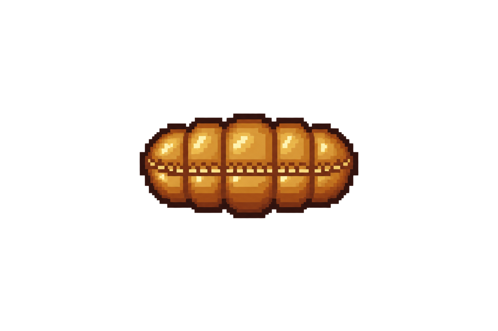
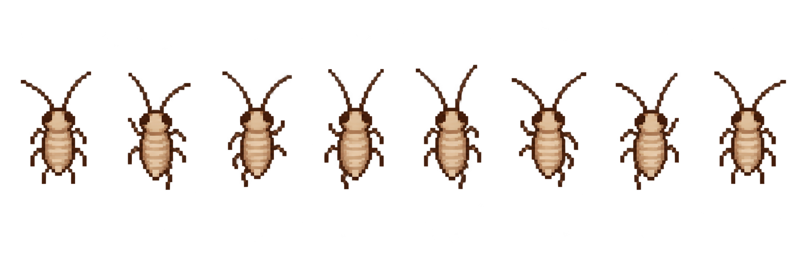
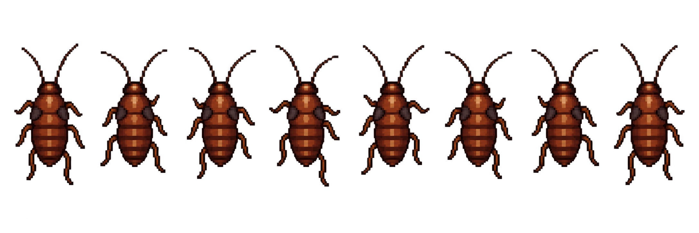
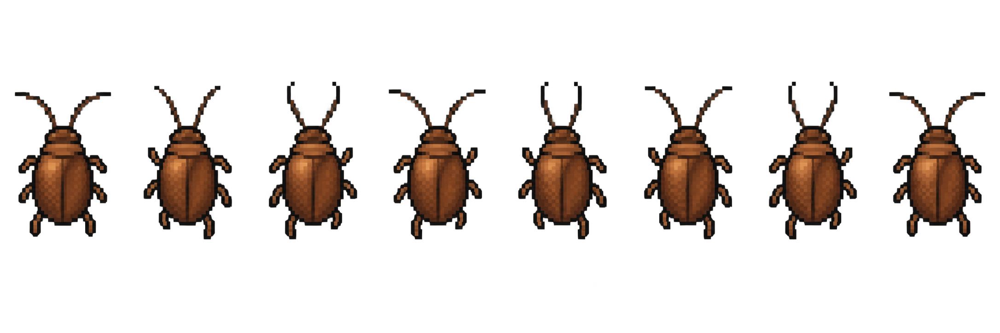

<div align="center">

# 🪳 蟑螂乐园

### 在 Windows 桌面上，建立一套会奔跑、成长与繁殖的像素生态系统

<p>
  
  
  
</p>

<p>
  <a href="https://github.com/Lolcano-l/roach-paradise/raw/refs/heads/main/release/RoachParadise.exe">
    
  </a>
</p>

**电脑没有中病毒，只是生态环境有点好。**

</div>

---

## ✨ 这里有什么？

| 🧬 完整生命周期 | 🏃 拟真行动逻辑 |
|:---:|:---:|
| 卵鞘 → 阶段一 → 阶段二 → 成虫 | 停留、转向、快速冲刺、贴边与避开鼠标 |
| 🌙 桌面生态 | 🧴 杀虫剂模式 |
| 昼伏夜出、聚集、繁殖与自然死亡 | 像素喷雾动画、范围伤害与鼠标瞄准 |

## 🔬 生命周期

<div align="center">

| 卵鞘 | 阶段一 | 阶段二 | 成虫 |
|:---:|:---:|:---:|:---:|
|  |  |  |  |
| 等待孵化 | 幼小、灵活 | 体型增长 | 繁殖与衰老 |

</div>

> [!TIP]
> 蟑螂不会永远乱跑。它们会停下来观察环境，转动身体，再沿头部朝向快速移动。

## 🎮 操作方式

| 操作 | 功能 |
|:---|:---|
| `F8` | 开启或关闭杀虫剂模式 |
| `F9` | 显示或隐藏控制面板 |
| 喷雾模式下单击 | 在鼠标位置喷洒杀虫剂 |
| 喷雾模式下右击 | 退出喷雾模式 |
| 右击托盘图标 | 投放、暂停、重启或退出 |

## 🚀 下载与运行

1. 下载 [`release/RoachParadise.exe`](release/RoachParadise.exe)。
2. 双击运行，无需安装。
3. 按 `F9` 打开控制面板，开始调整你的桌面生态。

> [!IMPORTANT]
> 当前程序尚未进行代码签名。若 Windows SmartScreen 显示“未知发布者”，请先确认文件来自本仓库，再决定是否运行。

## 🛠️ 从源码构建

在 Windows PowerShell 中运行：

```powershell
.\build.ps1
```

构建结果位于 `release/RoachParadise.exe`。脚本使用 Windows 自带的 .NET Framework C# 编译器，不需要额外下载依赖。

<details>
<summary><b>📁 查看项目结构</b></summary>

```text
assets/   像素动画素材
src/      C# / WPF 源码
release/  可直接运行的程序与说明
build.ps1 本地构建脚本
```

</details>

## 🧪 当前状态

- ✅ 兼容 32/64 位 Windows
- ✅ 素材全部嵌入单个 EXE
- ✅ 完整生态与生命周期
- 🚧 退出后暂不保存生态状态
- 🚧 暂未进行代码签名

---

<div align="center">

如果你的桌面还很干净，说明生态系统尚未启动。 🪳

</div>
